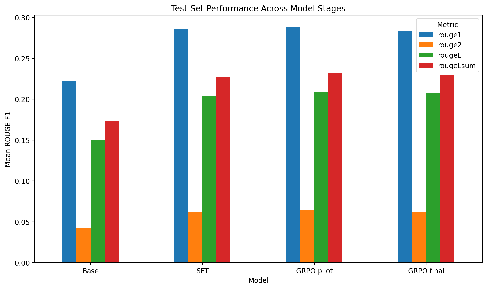

# Scientific LLM Fine-Tuning with LoRA SFT and GRPO

[](#installation)
[](https://huggingface.co/HuggingFaceTB/SmolLM2-135M-Instruct)
[](https://huggingface.co/Miladsaeedi70/smollm2-135m-scientific-sft-lora)
[](LICENSE)

A reproducible scientific language-model project that adapts
`HuggingFaceTB/SmolLM2-135M-Instruct` in two stages:

1. **LoRA supervised fine-tuning (SFT)** on 1,576 multi-task scientific examples.
2. **Group Relative Policy Optimization (GRPO)** using a frozen, groupwise
   LLM ranking judge.

The central technical contribution is a groupwise reward design that prevents
the zero-advantage problem caused by identical independent judge scores.

> The selected checkpoint is the **25-step GRPO pilot**. The 100-step
> checkpoint was effectively tied under direct pairwise judging, while the
> 25-step model achieved slightly stronger overall ROUGE-L.

## Key results

Weighted over the untouched 158-example test split:

| Model | ROUGE-1 | ROUGE-2 | ROUGE-L | ROUGE-Lsum | Mean words |
|---|---:|---:|---:|---:|---:|
| Base | 0.2220 | 0.0428 | 0.1501 | 0.1734 | 82.0 |
| SFT | 0.2858 | 0.0627 | 0.2048 | 0.2270 | 39.3 |
| **GRPO pilot (25 steps)** | **0.2885** | **0.0643** | **0.2088** | **0.2323** | 39.2 |
| GRPO final (100 steps) | 0.2832 | 0.0620 | 0.2075 | 0.2301 | 37.5 |

The 25-step and 100-step checkpoints received weighted direct judge scores of
**0.4968** and **0.5032**, respectively. Their difference
was below the 0.01 model-selection threshold.



## Method


### Why groupwise ranking?

Independent numerical judging frequently assigned the same score to all four
candidate responses. GRPO then produced zero relative advantages and no useful
learning signal.

The replacement reward presents all four candidates to the judge together and
requires a strict ranking. For four candidates, ranks are mapped to:

```text
1.00, 0.67, 0.33, 0.00
```

This produced a stable reward mean of 0.5 and nonzero within-group variance.

## Dataset

The dataset contains 1,576 examples:

| Split | Examples |
|---|---:|
| Train | 1,260 |
| Validation | 158 |
| Test | 158 |

Tasks:

- Scientific question answering
- Summarization
- Concept explanation
- Method comparison
- Technical simplification
- Bullet generation
- Data analysis
- Code generation

The dataset itself is not committed to this repository. See
[`data/README.md`](data/README.md) for the expected schema and publication
checklist.

## Repository structure

```text
scientific-llm-finetuning/
├── notebooks/
│   ├── 04_grpo_experiment.ipynb
│   └── executed/
│       └── 04_grpo_experiment_executed.ipynb
├── src/scientific_grpo/
│   ├── inference.py
│   └── reward.py
├── tests/
├── results/
├── assets/
├── docs/
├── data/
├── app.py
├── requirements.txt
└── README.md
```

The repository package currently includes Notebook 04, which was provided for
this GitHub build. Add Notebooks 01–03 from Google Drive before the final public
release.

## Installation

```bash
git clone https://github.com/YOUR_GITHUB_USERNAME/scientific-llm-finetuning.git
cd scientific-llm-finetuning

python -m venv .venv
source .venv/bin/activate  # Windows: .venv\Scripts\activate

pip install -r requirements.txt
pip install -e .
```

## Inference

The selected adapter is expected at:

```text
Miladsaeedi70/smollm2-135m-scientific-grpo-lora
```

After uploading the adapter to Hugging Face:

```bash
scientific-grpo \
  "Explain why spatial cross-validation matters for environmental ML."
```

or:

```bash
python -m scientific_grpo.inference \
  "Compare random and temporal cross-validation."
```

## Demo

```bash
python app.py
```

The same `app.py` can be deployed to a Hugging Face Gradio Space.

## Reproduce the GRPO experiment

1. Mount Drive or set `SFT_GRPO_ROOT`.
2. Place the processed `DatasetDict` at
   `data/processed/scientific_llm_dataset`.
3. Make the SFT adapter available locally or on Hugging Face.
4. Run `notebooks/04_grpo_experiment.ipynb`.
5. Verify positive `reward_std` and low `frac_reward_zero_std`.
6. Compare SFT, 25-step GRPO, and 100-step GRPO on the untouched test split.

Detailed notes are in [`docs/methodology.md`](docs/methodology.md).

## Evaluation cautions

- ROUGE measures reference overlap, not factual correctness.
- The same judge family contributed to training and evaluation, so pairwise
  results are not fully independent.
- The base model has only 135M parameters.
- Task-level performance varies; code generation and technical simplification
  did not improve consistently.
- Outputs must be independently checked for high-stakes scientific use.

## Roadmap

- [ ] Add dataset creation, tokenizer analysis, and SFT notebooks
- [ ] Upload the selected GRPO adapter to Hugging Face
- [ ] Publish a dataset card after licensing and duplication checks
- [ ] Deploy the Gradio demo
- [ ] Add evaluation with a second independent judge model
- [ ] Add bootstrap confidence intervals for metric differences
- [ ] Add human review of a stratified response sample

## Citation

See [`CITATION.cff`](CITATION.cff).
